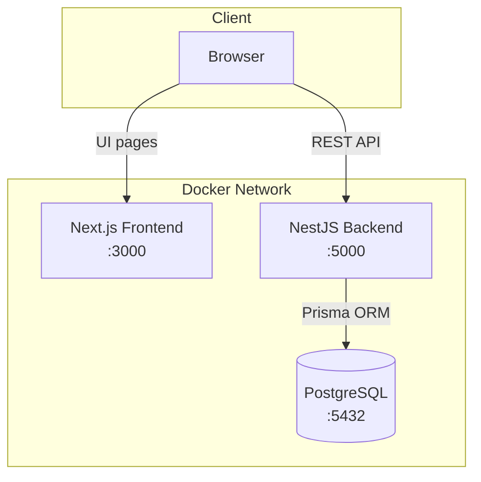

# 🏢 WORKFLEX — Employee Project Manager

> Mini-aplikacja do zarządzania pracownikami i projektami w kontekście outsourcingu pracowniczego WORKFLEX.

Full-stack web application built with **Next.js** (React + TypeScript) on the frontend, **NestJS** on the backend, **PostgreSQL** as the database, and **Prisma** as the ORM — all orchestrated via **Docker Compose**.

---

## 📋 Table of Contents

- [Features](#-features)
- [Tech Stack](#-tech-stack)
- [System Architecture](#-system-architecture)
- [Quick Start](#-quick-start)
- [API Endpoints](#-api-endpoints)
- [Project Structure](#-project-structure)
- [Design Decisions & Assumptions](#-design-decisions--assumptions)
- [What I'd Add With More Time](#-what-id-add-with-more-time)

---

## ✅ Features

- **Employee list** — view all employees with first name, last name, position, project, hourly rate, and status
- **Full CRUD** — create, edit, and delete employees
- **Filtering** — filter the employee list by project and status
- **Project cost summary** — `GET /api/employees/summary?project=X` returns total cost (Σ hourlyRate × hoursWorked)
- **Backend validation** — all inputs validated with `class-validator` DTOs
- **Dockerized** — one-command startup with `docker compose up --build`

---

## 🛠 Tech Stack

| Layer | Technology |
| :--- | :--- |
| **Frontend** | Next.js 16, React 19, TypeScript, Tailwind CSS 4, shadcn/ui |
| **Backend** | NestJS 11, TypeScript, Prisma ORM 7 |
| **Database** | PostgreSQL 15 |
| **Data Fetching** | Axios, TanStack React Query |
| **Validation** | class-validator, class-transformer |
| **Containerization** | Docker, Docker Compose |

---

## 🏗️ System Architecture



---

## ⚡ Quick Start

### Prerequisites
- **Docker** & **Docker Compose** (recommended)
- *or* **Node.js 20+** and a running **PostgreSQL** instance (for local dev)

### Option 1 — Docker Compose (recommended)

```bash
# 1. Clone the repository
git clone https://github.com/<your-username>/employee-project-manager.git
cd employee-project-manager

# 2. Copy environment template
cp .env.example .env

# 3. Start all services
docker compose up --build
```

Services will be available at:
- 🌐 Frontend: [http://localhost:3000](http://localhost:3000)
- ⚙️ Backend API: [http://localhost:5000](http://localhost:5000)
- 🗄️ Database: `localhost:5432`

### Option 2 — Local Development

```bash
# Terminal 1: Start the backend
cd backend
cp .env.example .env   # update DATABASE_URL if needed
npm install
npx prisma migrate dev
npm run start:dev

# Terminal 2: Start the frontend
cd frontend
npm install
npm run dev
```

---

## 📡 API Endpoints

| Method | Endpoint | Description |
| :--- | :--- | :--- |
| `GET` | `/api/employees` | List all employees (supports `?project=X&status=Y` filters) |
| `GET` | `/api/employees/:id` | Get a single employee |
| `POST` | `/api/employees` | Create a new employee |
| `PUT` | `/api/employees/:id` | Update an employee |
| `DELETE` | `/api/employees/:id` | Delete an employee |
| `GET` | `/api/employees/summary?project=X` | Get project cost summary |

### Example: Project Summary Response

```json
{
  "project": "WORKFLEX Portal",
  "employeeCount": 3,
  "totalHours": 450,
  "totalCost": 33750.00,
  "employees": [
    {
      "id": 1,
      "name": "Jan Kowalski",
      "position": "Developer",
      "hourlyRate": 75,
      "hoursWorked": 200,
      "cost": 15000.00
    }
  ]
}
```

---

## 📁 Project Structure

```text
employee-project-manager/
├── backend/
│   ├── prisma/
│   │   └── schema.prisma           # Database schema (Employee model)
│   ├── src/
│   │   ├── employees/
│   │   │   ├── dto/                 # Validation DTOs (create, update)
│   │   │   ├── employees.controller.ts
│   │   │   ├── employees.service.ts
│   │   │   └── employees.module.ts
│   │   ├── prisma/                  # Prisma service & module
│   │   ├── app.module.ts            # Root module
│   │   └── main.ts                  # Entry point (CORS, validation pipe)
│   ├── Dockerfile
│   └── package.json
├── frontend/
│   ├── app/                         # Next.js App Router pages
│   ├── components/                  # React components (shadcn/ui)
│   ├── lib/
│   │   ├── api.ts                   # Axios API client
│   │   ├── types.ts                 # TypeScript interfaces
│   │   └── utils.ts                 # Utility functions
│   ├── Dockerfile
│   └── package.json
├── docker-compose.yml               # Orchestration
├── .env.example                     # Environment template
└── README.md
```

---

## 💡 Design Decisions & Assumptions

1. **Single project per employee** — the task says "projekt" (singular), so each employee is assigned to one project as a string field. If many-to-many were needed, a separate `Project` model with a join table would be the way to go.

2. **Flat project field** — projects are stored as a `project: string` on each employee rather than a separate `Project` table. This simplifies the initial implementation while still supporting filtering and summary aggregation. A normalized `Project` model can be introduced later.

3. **NestJS over Express** — provides structured, module-based architecture with dependency injection, making the codebase more maintainable and testable. Good match for the "code structure" evaluation criterion.

4. **Prisma ORM** — type-safe database access with auto-generated types, migrations, and a clean query API. Eliminates raw SQL while keeping full control over the schema.

5. **Backend validation** — `class-validator` DTOs with `whitelist: true` and `forbidNonWhitelisted: true` ensure no extraneous fields are accepted, and all required fields are properly validated.

6. **Docker Compose** — enables one-command startup of the full stack (frontend + backend + database), consistent across environments.

---

## 🚀 What I'd Add With More Time

- **Unit tests** — Jest tests for `EmployeesService` (especially `getProjectSummary` calculation logic)
- **E2E tests** — Supertest-based tests for the REST API endpoints
- **Pagination** — `?page=1&limit=20` support for the employees list
- **Search** — full-text search across firstName, lastName, position
- **Separate Project model** — normalized `Project` entity with many-to-many relationship
- **Authentication** — JWT-based auth with role-based access control
- **Swagger/OpenAPI** — auto-generated API docs via `@nestjs/swagger`
- **Database seeding** — `prisma db seed` script with realistic sample data
- **Error handling** — global exception filter with consistent error response format
- **CI/CD** — GitHub Actions pipeline for lint → test → build → deploy
