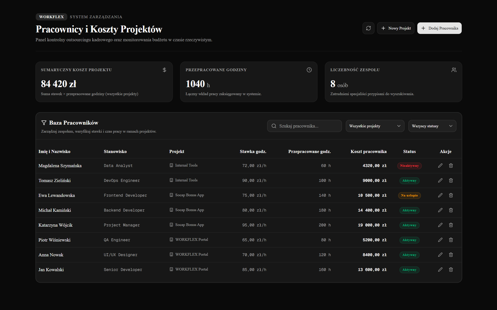
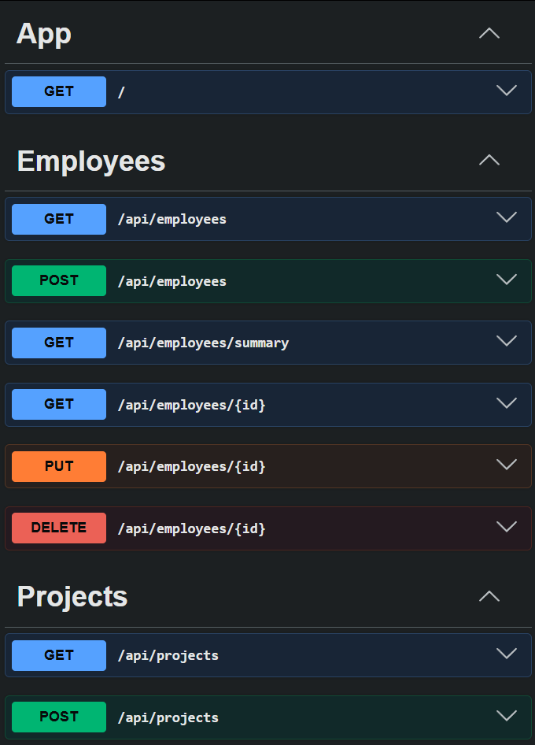

# 🏢 WORKFLEX — Employee Project Manager

> Full-stack application to manage employees and outsourcing projects for **WORKFLEX**.

Built with **Next.js 16** (React 19) on the frontend, **NestJS 11** on the backend, **PostgreSQL** as the database, and **Prisma ORM 7** for data access. Automated with **Docker Compose**.

---

## 📋 Table of Contents

- [Features](#-features)
- [Tech Stack](#-tech-stack)
- [Quick Start](#-quick-start)
- [API Endpoints](#-api-endpoints)
- [Implemented Custom Enhancements](#-implemented-custom-enhancements)
- [🚀 What I'd Add With More Time](#-what-id-add-with-more-time)

---

## ✅ Features

- **Employee List** — Display all employees with status and project filters.
- **CRUD Operations** — Create, read, edit, and delete employee records.
- **Project Management** — Separate database model for projects. Modals use Select fields to prevent typos.
- **Project Cost Summary** — REST endpoint `/api/employees/summary?project=X` calculating total hours and cost (Σ hourly rate × hours worked).
- **SSR with Graceful Fallback** — Next.js Server Components fetching initial data with Client-Side fallback.
- **Form Validation UX**:
  - Visual border highlights for invalid inputs.
  - Validation warning texts displayed under fields.
  - Clearing error highlights when users start typing.
- **Pulsing Loading State** — Plain text `---` placeholder markers in KPI card stats during reload operations.
- **Docker Setup** — Run database, backend, and frontend via a single command.

---

## 🛠 Tech Stack

| Layer                | Technology                                                               |
| :------------------- | :----------------------------------------------------------------------- |
| **Frontend**         | Next.js 16 (App Router), React 19, TypeScript, Tailwind CSS 4, shadcn/ui |
| **Backend**          | NestJS 11, TypeScript, Prisma ORM 7, @nestjs/swagger                     |
| **Database**         | PostgreSQL 15                                                            |
| **Data Fetching**    | Axios, TanStack React Query v5                                           |
| **Validation**       | class-validator, class-transformer                                       |
| **Containerization** | Docker, Docker Compose                                                   |

---

## ⚡ Quick Start

### Prerequisites

- **Docker** & **Docker Compose**
- _or_ **Node.js 20+** and a running **PostgreSQL** instance

### Option 1 — Run with Docker Compose (Recommended)

```bash
# 1. Clone the repository
git clone https://github.com/<your-username>/employee-project-manager.git
cd employee-project-manager

# 2. Copy environment template
cp .env.example .env

# 3. Start all services
docker compose up -d --build
```

Services will be available at:

- 🌐 **Frontend UI**: [http://localhost:3000](http://localhost:3000)
- 📖 **Swagger API Docs**: [http://localhost:5000/api/docs](http://localhost:5000/api/docs)
- ⚙️ **Backend API**: [http://localhost:5000](http://localhost:5000)

### Option 2 — Local Development

```bash
# Terminal 1: Run NestJS Backend
cd backend
cp .env.example .env   # Update DATABASE_URL to target your Postgres instance
npm install
npx prisma migrate dev
npx prisma db seed     # Seed database with sample data
npm run start:dev

# Terminal 2: Run Next.js Frontend
cd frontend
npm install
npm run dev
```

---

## 📡 API Endpoints

| Method   | Endpoint                           | Description                                                 |
| :------- | :--------------------------------- | :---------------------------------------------------------- |
| `GET`    | `/api/employees`                   | List all employees (supports `?project=X&status=Y` filters) |
| `GET`    | `/api/employees/:id`               | Get details of a single employee                            |
| `POST`   | `/api/employees`                   | Create a new employee with DTO validation                   |
| `PUT`    | `/api/employees/:id`               | Update an existing employee                                 |
| `DELETE` | `/api/employees/:id`               | Delete an employee                                          |
| `GET`    | `/api/employees/summary?project=X` | Calculate hours and cost aggregates for a project           |
| `GET`    | `/api/projects`                    | List all projects                                           |
| `POST`   | `/api/projects`                    | Create a new project                                        |

---

## ✅ Implemented Custom Enhancements

- **Unit Testing** — Jest unit tests for NestJS service CRUD and aggregate calculation logic.
- **Dynamic Seeding** — Auto-seeding script running on Docker startup using PostgreSQL Driver Adapter.
- **Real-Time Search** — Text search matching against employee's `firstName`, `lastName`, and `position`.
- **Inline Validation** — Red form borders and inline context messages for failed validation.

---

## 🚀 What I'd Add With More Time

- **Soft Delete for Employees** — Implement a `deletedAt` field on the Employee model to preserve historical financial metrics.
- **Full Project CRUD** — Add frontend and backend support to edit and delete database projects.
- **Server-Side Pagination** — Add support for `?page=X&limit=Y` parameters to handle large datasets.

---

- **End-to-End Test Suite** — Fully automated E2E tests using Playwright or Cypress.
- **Authentication & Authorization** — Secure endpoints using JWT-based auth guards and roles (e.g. Admin, Manager).
- **CI/CD Pipeline** — GitHub Actions configuration for linting, testing, and Docker builds.

---

## ✅ Screenshots




